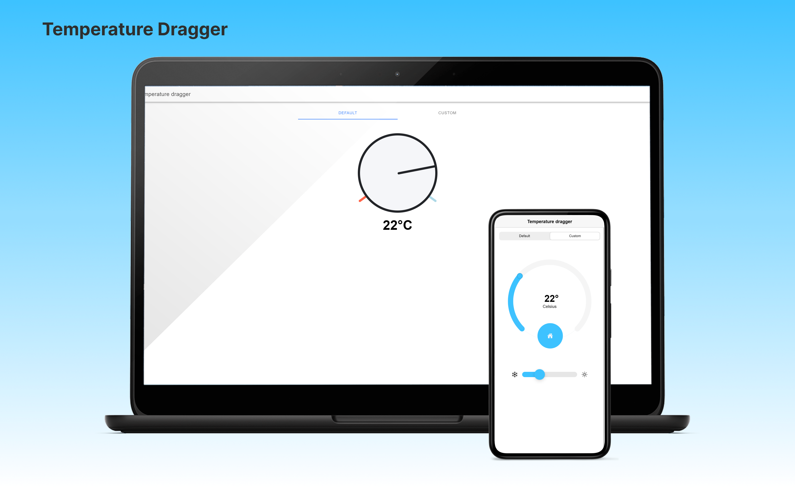

<p align="center">
    
</p>

<h4 align="center">A simple temperature dragger developed using Angular (ionic)</h4>

<p align="center">
  <a href="#key-features">Key Features</a> •
  <a href="#how-to-use">How To Use</a> •
  <a href="#credits">Credits</a> •
</p>

## Key Features

- Live preview
  - Instantly see the temperature on the monitor as changed using the valve
- Cross platform
  - Android, Ios, Web

## How To Use

To clone and run this application, you'll need [Git](https://git-scm.com) and [Node.js](https://nodejs.org/en/download/) (which comes with [npm](http://npmjs.com)) installed on your computer.

You also need to have the [ionic CLI](https://ionicframework.com/docs/intro/cli)

Install the Ionic CLI with npm:

```bash
  npm install -g @ionic/cli
```

> **Note**
> The -g option means install globally. When packages are installed globally, EACCES permission errors can occur. Consider setting up npm to operate globally without elevated permissions

From your command line:

```bash
# Clone this repository
$ git clone https://github.com/carloseduardovieira/temperature-dragger

# Go into the repository
$ cd temperature-dragger

# Install dependencies
$ npm install

# Run the app
$ ionic serve
```

## Credits

The custom temperature dragger component was developed based on the [NGX](https://akveo.github.io/nebular/) component. I made some adaptations to support ionic.
